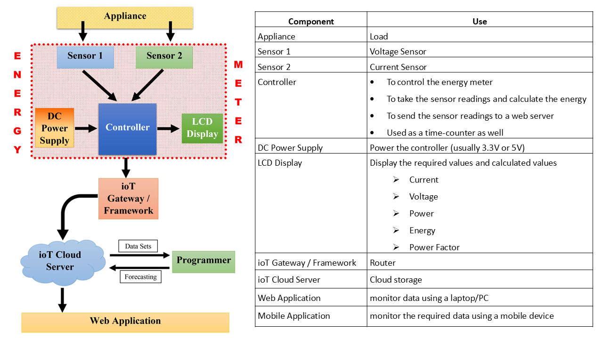
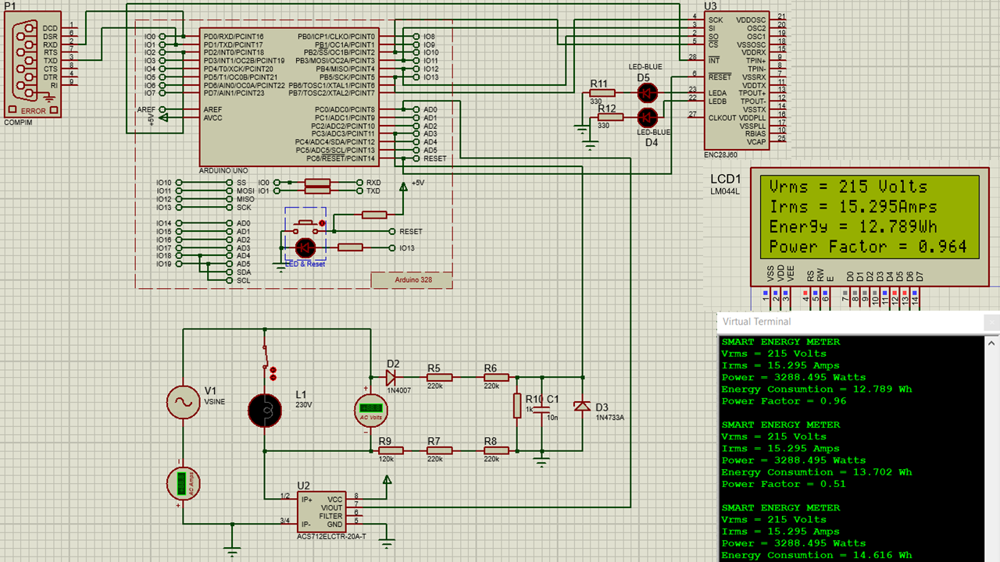
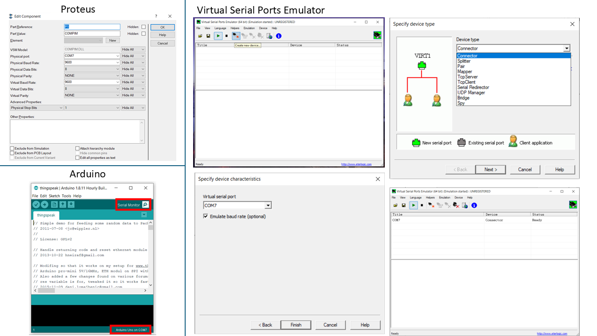
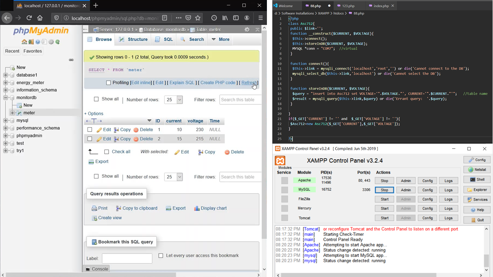
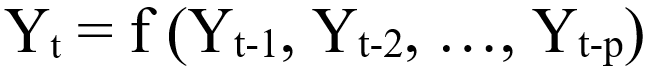
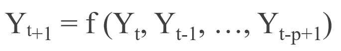
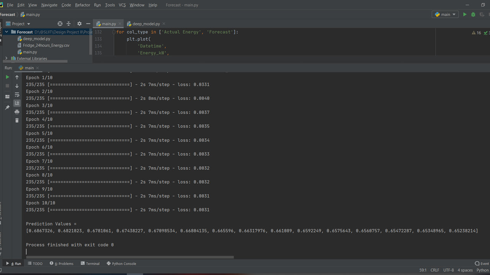
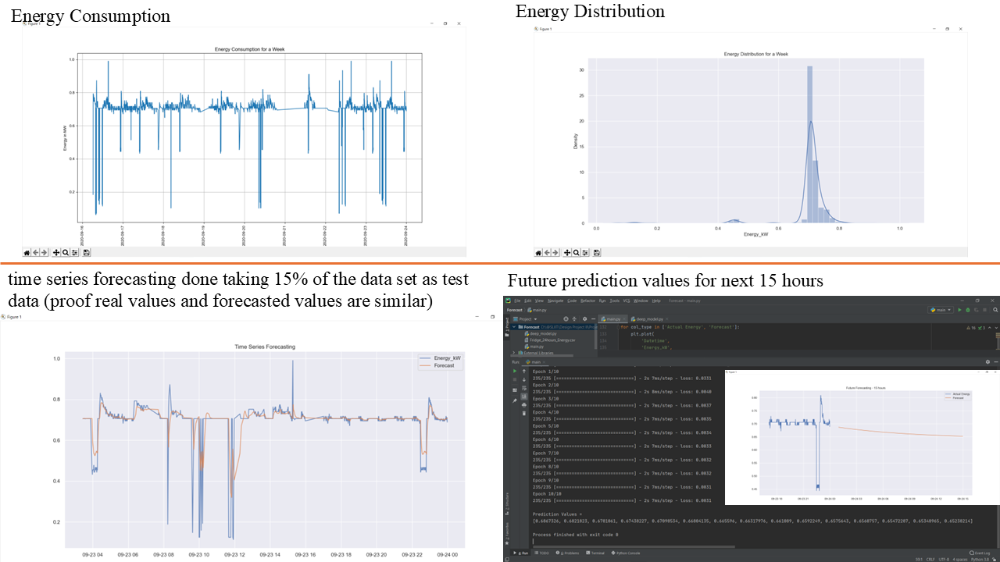
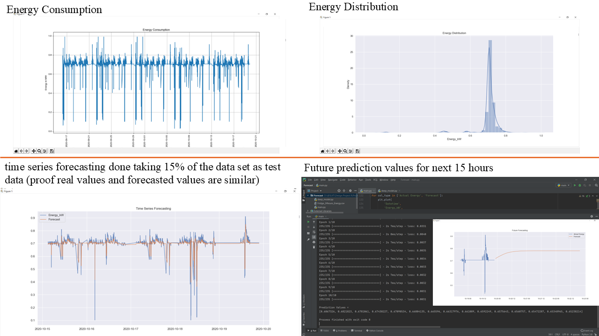
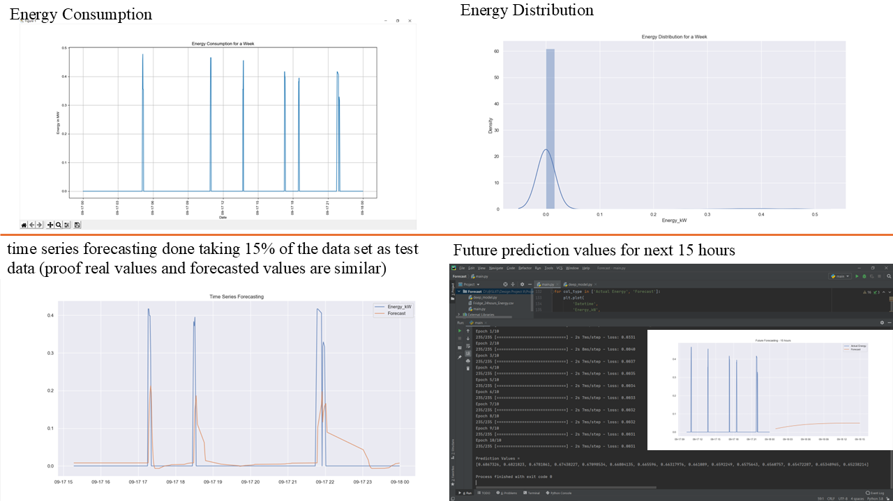

# ioT-based Smart Energy Meter

IoT-Based Smart Energy Meter with Energy Forecasting

This repository contains the work for a University Module Team Project.

---

## 🎯 Objectives  
The main objective of this project was to design and simulate a system that can monitor real-time energy consumption, calculate electricity usage, and introduce smart billing while also predicting future consumption patterns using machine learning. 

This project aimed to demonstrate how energy wastage can be reduced, bills optimized, and usage trends analyzed for better decision-making.  

---

## 👥 Contributions  

### 🔹 Team Contributions  
- Energy meter designing
- Energy calculations (Power, Energy, Power Factor)
- ioT connectivity
- cloud integration
- Energy Forecasting
- Smart billing

### 🔸 **My Contributions**  
- Developed the **simulation design** in Proteus (Arduino + sensors + IoT cloud flow).  Simulated ioT connectivity with Ethernet Shield / ENC28J60.  
- Implemented **Energy Forecasting** using Deep Learning (LSTM in Python), including dataset preparation, model training, and future usage prediction.  

---

# A. Simulation

## 🛠 Tools
- **Proteus 8 Professional** - Circuit design & simulation.  
- **Arduino IDE** - Code development & .hex file generation.  
- **MySQL + PhpMyAdmin** - Simulated cloud platforms.  

## 💻 Components Used
- **Arduino UNO**
- **ACS712 Current Sensor**.  
- **Voltage Divider Circuit** (alternative to unavailable ZMPT101B).  
- **ENC28J60 Ethernet Controller / Arduino Ethernet Shield**.  
- **LCD Display** (for real-time values).
- 
## 🧮 Energy Calculation
- P (Watts) = V x I
- E (Jouls) = P x t 
- E (Watts per hour) = (P x t) / 3600
- θ = 50Hz x 360 x ∆t
- Power Factor = cosθ
- True Power (P) = V I cosθ
> **Note:** The Arduino code calculating the Vrms, Irms, Power, and Energy calculations is attached.

## 📸 Images  

### System Block Diagram

  

#### Connections
| ENC28J60 Module Pin |    Arduino UNO Pin   |
|---------------------|----------------------|
|         Vcc         |          3.3V        |
|        RESET        |         RESET        |
|         INT         |           D2         |
|         GND         |          GND         |
|         SCK         |          D13         |
|        MISO         |          D12         |
|        MOSI         |          D11         |
|         CS          |          D10         |

### ioT Smart Meter Simulation

**Proteus Simulation**  

  
> **Note:** Simulation files are attached.

**Serial Connection Implemention**  

  

**phpMyAdmin Database**  

  
> **Note:** The .php files are attached.

---

# B.Energy Forecasting  

Implemented **Energy Consumption Forecasting** using Deep Learning (LSTM).  
This helps predict future energy usage trends, enabling smarter decisions and optimized billing.

## 👇 Approach
- Used **LSTM (Long Short-Term Memory)** model in Python (TensorFlow/Keras).
- Input: historical energy data (1-sec intervals).
- Output: short-term & long-term energy usage forecasts.

## 👣 Key Steps
1. Data preprocessing & lag feature generation (20 lags).
2. LSTM model definition
3. Initialize the basic modelling parameters (lag, LSTM layer depth, epochs, batch size, test split for training)
4. Training (85% training, 15% testing)
5. Forecasting next 15 hours of energy usage.
6. Compared real vs predicted consumption.

## 🛠 Tools
- **Python (TensorFlow, Keras, Pandas, NumPy)** – Energy forecasting (LSTM).  
- **MySQL + PhpMyAdmin** – Simulated cloud platforms.  

## 📚 Deep Learning

**Algorithm Function for A Time Series Data**

  

**Forecasting Formula**

  

## 📸 Images  

**Training Process for 10 Epochs**  

  

**Energy Consumption Prediction for a data set of a Refrigerator for 7 Days**

  
> **Note:** The python code used for forecasting is attached.

**Energy Consumption Prediction for a data set of a Refrigerator for 30 Days**  

  

**Energy Consumption Prediction for a data set of a Heater for 7 Days**  

  
> **Note:** The python code used for forecasting is attached.

---

## ⚡ Challenges Faced  
- Limited sensor availability in Proteus → used alternatives.  
- ioT simulation challenges with ESP8266 → replaced with Ethernet controllers.  
- Debugging Arduino .hex file & baud rate errors.  
- Long training times for ML models with large datasets.  

---

## 👥 Team & Acknowledgments  
- Thanks to supervisors and teammates for collaboration and guidance.
- This repository contains only my individual contributions, maintained separately for clarity and documentation purposes.

---

## 📄 License
This project is shared for educational purposes. Please give credit if you use it.

---

## 📬 Contact
If you have feedback or suggestions, feel free to [open an issue](https://github.com).

---

## 🎥 Project Demo

▶️ [Click here to watch the Simulation Demo](Videos/Database-and-Simulation.mp4)

▶️ [Click here to watch the Forecasting Demo](Videos/Forecasting-Fridge.mp4)
