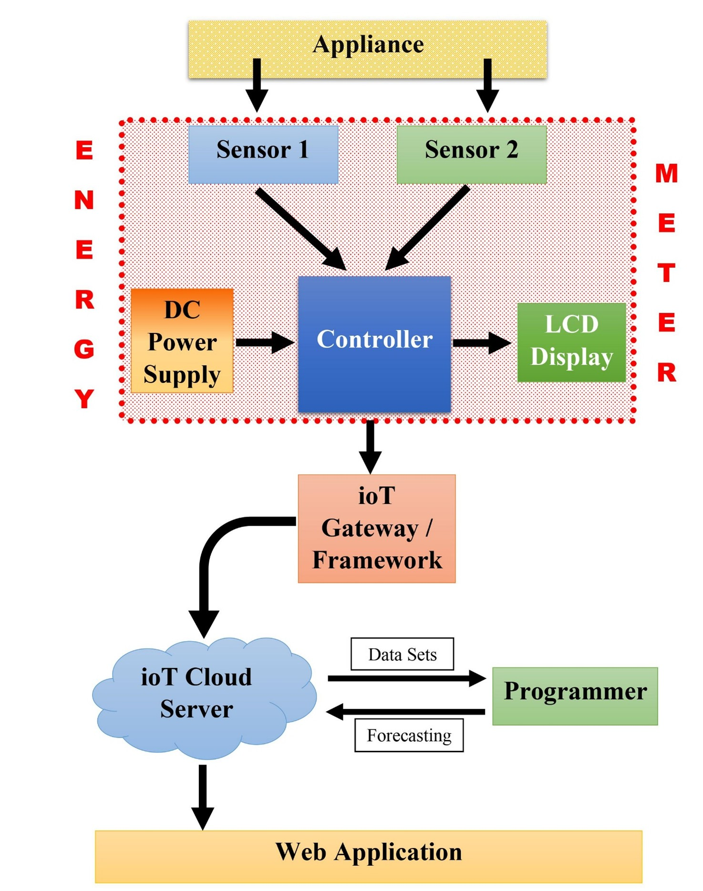
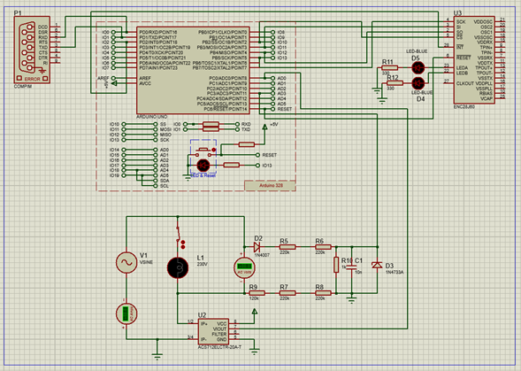
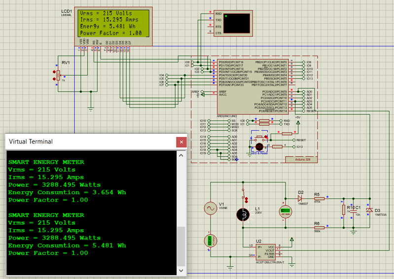
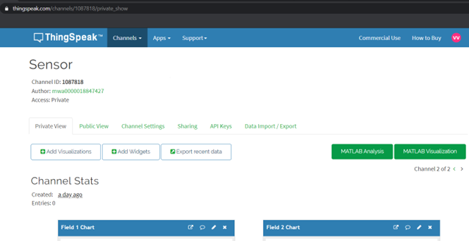

# ioT-based-Smart-Energy-Meter

IoT-Based Smart Energy Meter with Energy Forecasting

This repository contains the work for a University Module Team Project (Simulation-Based Only).

---

## 🎯 Objectives  
The main objective of this project was to design and simulate a system that can monitor real-time energy consumption, calculate electricity usage, and introduce smart billing while also predicting future consumption patterns using machine learning. 

This project aimed to demonstrate how energy wastage can be reduced, bills optimized, and usage trends analyzed for better decision-making.  

---

## 👥 Contributions  

### 🔹 Team Contributions  
- Designed energy meter simulation in Proteus with Arduino UNO.  
- Implemented energy calculations (Power, Energy, Power Factor).  
- Simulated IoT connectivity with Ethernet Shield / ENC28J60.  
- Explored cloud integration (ThingSpeak, MySQL/PhpMyAdmin, Google Cloud).  

### 🔸 **My Contributions**  
- **Semester 1** – Developed the **simulation design** in Proteus (Arduino + sensors + IoT cloud flow).  
- **Semester 2** – Implemented **Energy Forecasting** using Deep Learning (LSTM in Python), including dataset preparation, model training, and future usage prediction.  

---

## 🛠 Tools & Components  

### Tools  
- **Proteus 8 Professional** – Circuit design & simulation.  
- **Arduino IDE** – Code development & .hex file generation.  
- **Python (TensorFlow, Keras, Pandas, NumPy)** – Energy forecasting (LSTM).  
- **ThingSpeak / MySQL + PhpMyAdmin / Google Cloud** – Simulated cloud platforms.  

### Components Used
- **Arduino UNO**
- **ACS712 Current Sensor**.  
- **Voltage Divider Circuit** (alternative to unavailable ZMPT101B).  
- **ENC28J60 Ethernet Controller / Arduino Ethernet Shield**.  
- **LCD Display** (for real-time values).  

### Connections

| ENC28J60 Module Pin |    Arduino UNO Pin   |
|---------------------|----------------------|
|         Vcc         |          3.3V        |
|        RESET        |         RESET        |
|         INT         |           D2         |
|         GND         |          GND         |
|         SCK         |          D13         |
|        MISO         |          D12         |
|        MOSI         |          D11         |
|         CS          |          D10         |

---

## 📈 Key Features  
- Simulation-based IoT smart energy meter (no hardware build due to COVID).  
- Real-time monitoring of Vrms, Irms, Power, Energy, and Power Factor.  
- Smart billing calculation in simulation.  
- Energy forecasting using LSTM (Deep Learning).  
- Future-ready concept combining **IoT + AI** for energy efficiency.  

---

## 📸 Images  

### System Block Diagram
  

### ioT Smart Meter Simulation
**Proteus Simulation**  
  
**LCD Display Output**  
  
**ThingSpeak Dashboard**  
  

### Energy Forecasting  
  
  
  
  

---

## ⚡ Challenges Faced  
- COVID restrictions → simulation-only implementation.  
- Limited sensor availability in Proteus → used alternatives.  
- IoT simulation challenges with ESP8266 → replaced with Ethernet controllers.  
- Debugging Arduino .hex file & baud rate errors.  
- Long training times for ML models with large datasets.  

---

## 👥 Team & Acknowledgments  
- Thanks to supervisors and teammates for collaboration and guidance.
- This repository contains only my individual contributions, maintained separately for clarity and documentation purposes.

---

## 📄 License
This project is shared for educational purposes. Please give credit if you use it.

---

## 📬 Contact
If you have feedback or suggestions, feel free to [open an issue](https://github.com).

---
